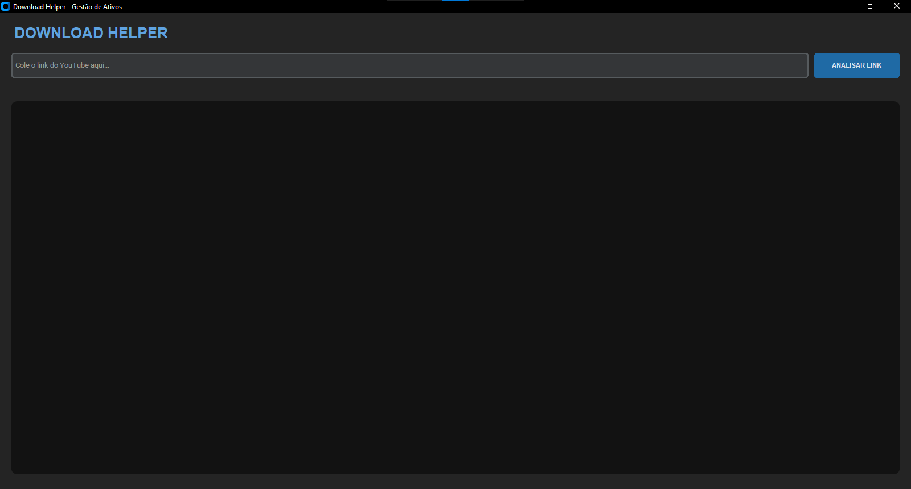

# DownloadHelper - YouTube Download Manager

Este repositório contém o código-fonte do **DownloadHelper**, uma ferramenta de código aberto desenvolvida em Python para o gerenciamento avançado de downloads do YouTube. O projeto foca em precisão de status de arquivos e suporte a operações retomáveis (pausa/continuação).

## 🚀 Visão Geral (v1.0.1-beta)

O DownloadHelper foi projetado para oferecer uma interface de gestão de downloads estável e profissional. A lógica principal permite o processamento de vídeos individuais e playlists, garantindo integridade de dados através da sincronização com os motores do `yt-dlp`, binários do `FFmpeg` e um sistema de monitoramento em tempo real.

---

## 📂 Arquitetura de Pastas (v1.0.1-beta)

A organização do diretório segue o padrão de separação de responsabilidades para facilitar a manutenção e o porte entre Windows e Android:

* **Raiz:** Contém o ponto de entrada (`main.py`), dependências (`requirements.txt`) e scripts de build (`downloadhelper.spec`, `buildozer.spec`, `setup.iss`).
* **core/:** Lógica de processamento, configurações de versão e funções auxiliares.
* **ui/ & kv/:** Separação da lógica de comportamento (Python) e design visual (Kivy Language).
* *Nota: O antigo `popups` foi renomeado para `options_dialogs` para maior clareza.*
* **docs/:** Contém os textos de **Política de Privacidade** e **Termos de Uso** lidos internamente pelo aplicativo.
* **ffmpeg/:** Pasta destinada aos binários de conversão de mídia (necessários para a versão desktop). **Nota: Os arquivos executáveis não são incluídos no repositório.**
* **assets/:** Identidade gráfica, ícones e recursos visuais para Windows e Android.

---

## ⚙️ Especificações Técnicas

O desenvolvimento priorizou a portabilidade e a conformidade com as políticas de segurança:

* **Linguagem:** Python 3.13+ com framework Kivy/KivyMD.
* **Processamento de Mídia:** Integração nativa com FFmpeg para alta fidelidade de áudio e vídeo.
* **Proteção Jurídica:** Termos de uso e política de privacidade integrados na interface do usuário (janela "Sobre").
* **Multiplataforma:**
* **Windows:** Compilação via PyInstaller e instalador profissional via Inno Setup.
* **Android:** Geração de APK via Buildozer (Linux/Ubuntu).

---

## 🖼️ Demonstração da Interface

### Interface Principal



---

## 🛠️ Procedimentos de Instalação e Uso

### Para Desenvolvedores (Rodar via Código)

1. **Clone o repositório:**

    ```bash
    git clone [https://github.com/JoseIzataQuinvula/download-helper.git](https://github.com/JoseIzataQuinvula/download-helper.git)
    cd download-helper
    ```

2. **Instale as dependências:**

    ```bash
    pip install -r requirements.txt
    ```

3. **Configuração do FFmpeg (Obrigatório para Windows local):**

    Baixe os binários em [ffmpeg.org](https://ffmpeg.org) e coloque `ffmpeg.exe`, `ffplay.exe` e `ffprobe.exe` dentro da pasta `ffmpeg/`.

4. **Execução:**

    ```bash
    python main.py
    ```

---

## 📦 Compilação e Distribuição

### Para Windows (EXE)

A versão **v1.0.1-beta**
corrige falhas de inicialização (tela preta). Para gerar o executável:

```bash
pyinstaller --noconfirm downloadhelper.spec
Para criar o instalador profissional, utilize o Inno Setup com o arquivo setup.iss.

Para Android (APK)
Em um ambiente Linux (Ubuntu/WSL2), execute:

Bash
buildozer android debug
📜 Licença e Privacidade
Este projeto é de código aberto sob a licença MIT. O DownloadHelper respeita a sua privacidade: não coletamos dados e todo o processamento é feito localmente no seu dispositivo.

Desenvolvido por José Izata Quivula.
